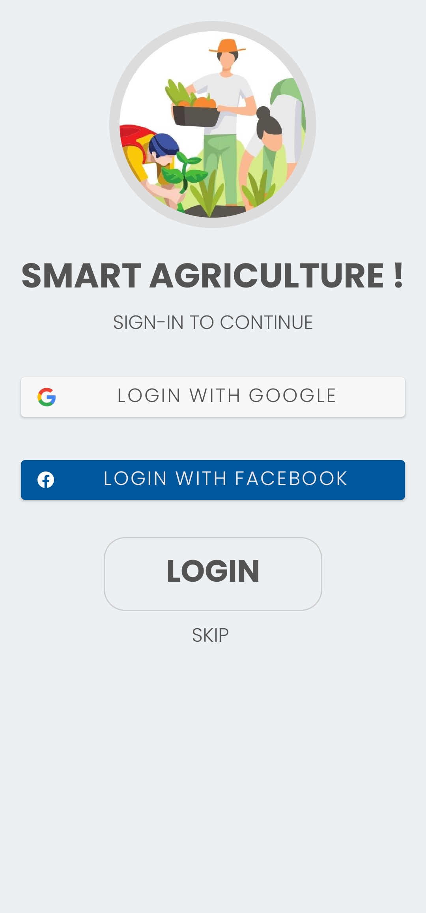
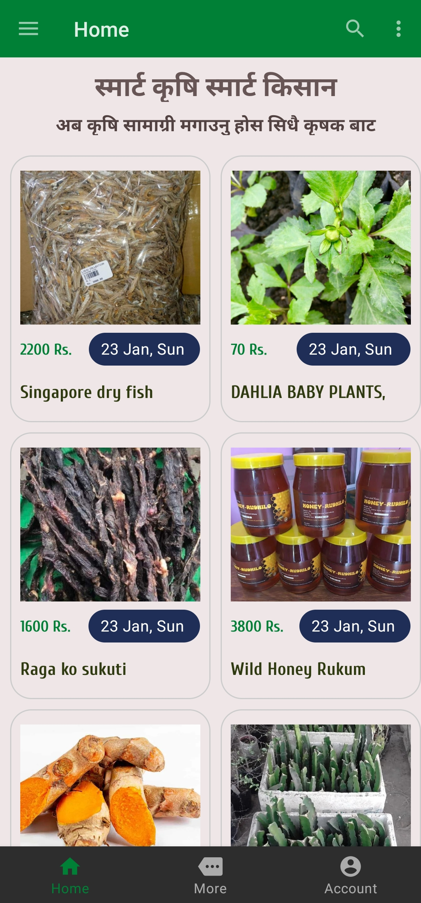
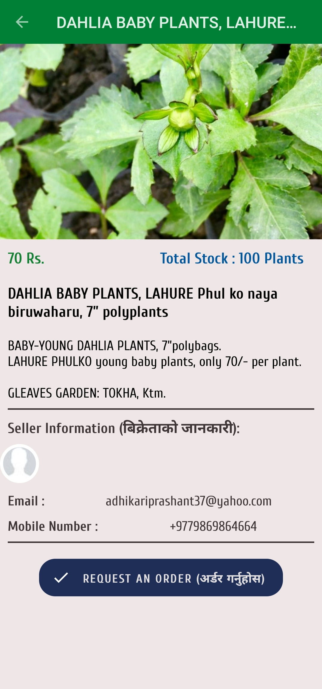
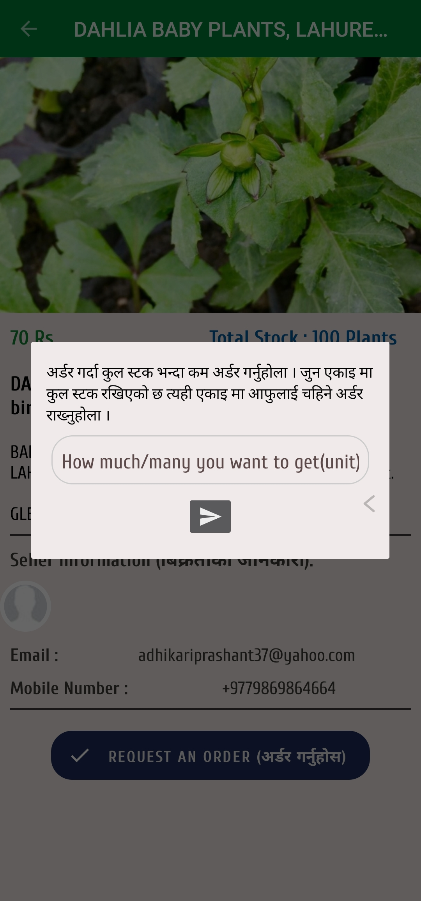
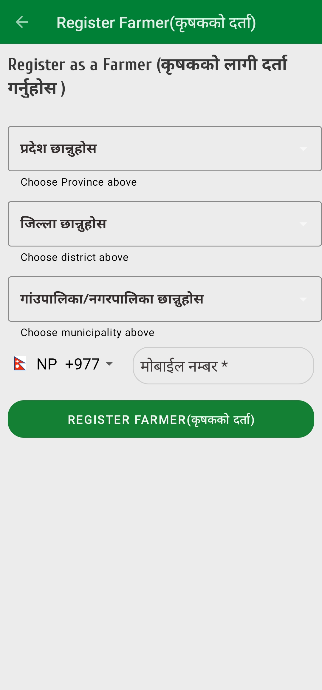
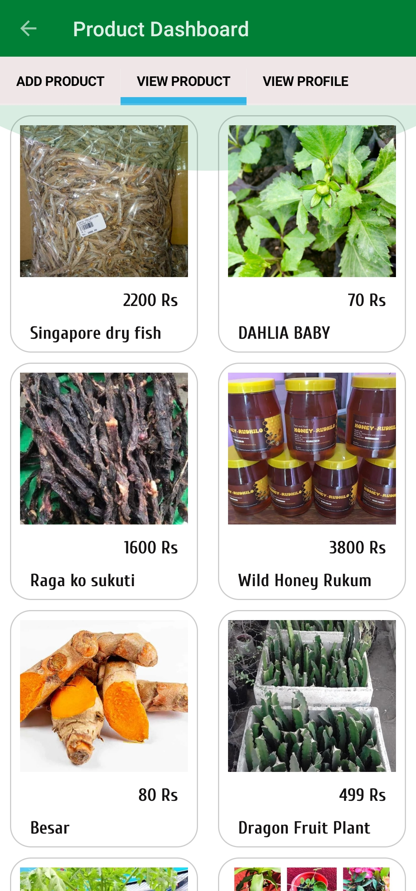
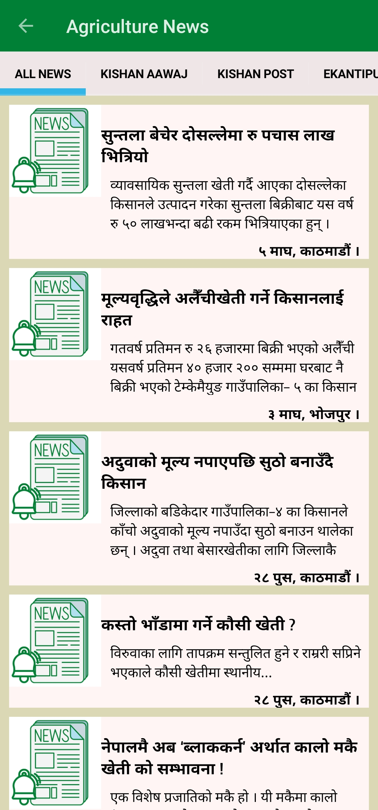
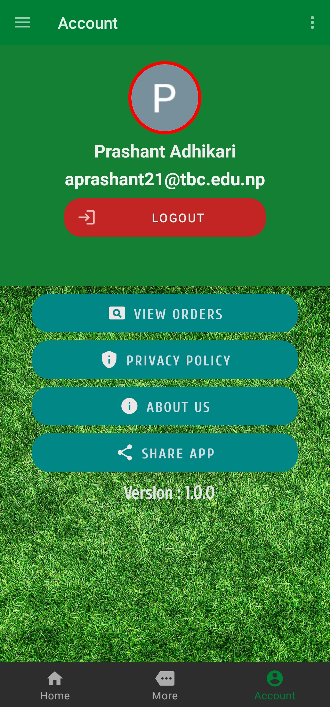
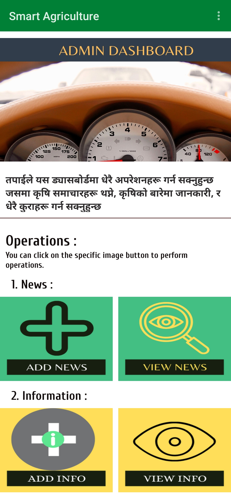

# Smart-Agriculture

Smart Agriculture is an andriod app which helps to remove 
gap between farmer and buyers. It works on MVC architecture. 

After opening the app, a splash screen seen in the screen like snapshot below:

After splash screen, You can see home screen like snapshot below:

After clicking on the specific item to buy the product,
Product description screen is appear as seen in the snapshot below
 

If you are interested to register as farmer then you have option in more menu to register as farmer, 
After clicking on that option you can redirected to the screen shown below to register
as a farmer. and after adding product you can view product like image below.
  

Besides that there are lots of screens/pages, snapshots of some of the pages are shown below:

 

There is admin dashboard too which helps to add news and information for admin to the front of the page.

